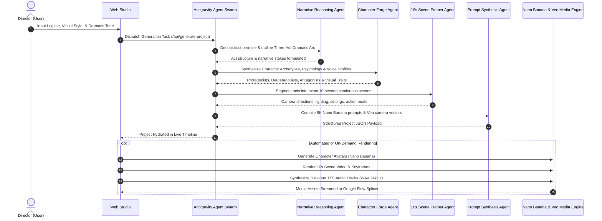

# 🎬 Antigravity Cinematic Flow Studio

> **Agentic Narrative Video Studio powered by Google Antigravity Agents, Google Flow Timeline Splicer, Nano Banana Image Generation, and Veo / Omni Video Synthesis.**

---

## 🌟 Overview

**Antigravity Cinematic Flow Studio** is an agentic, full-stack cinematic filmmaking workstation. It automates narrative ideation, character psychology forging, three-act dramatic structural breakdown, 10-second continuous scene framing, multi-modal keyframe generation, dialogue voice synthesis, and multi-track non-linear video timeline splicing.

```
+--------------------------------------------------------------------------------------------------+
|                                  ANTIGRAVITY CINEMATIC STUDIO                                    |
|                                                                                                  |
|   [Prompt Input] ---> [Agent Swarm] ---> [Acts & Scenes] ---> [Nano Banana & TTS] ---> [Cinema]  |
|   "Cyberpunk Noir"     - Reasoner         - Act 1 (10s x 2)   - 8K Keyframes (1:1/16:9)  - Splicer   |
|                        - Character Forge  - Act 2 (10s x 2)   - Gemini TTS Voice Tracks  - 21:9 HUD  |
|                        - Prompt Synthesizer- Act 3 (10s x 2)   - Veo/Omni 10s Video Clips - Export   |
+--------------------------------------------------------------------------------------------------+
```

---

## 📐 System Architecture

### 1. High-Level Architecture Diagram

```mermaid
graph TD
    subgraph Client ["Client Interface (React 19 + Tailwind CSS + Motion)"]
        UI_Prompt["Story Prompt & Style Selector"]
        UI_Cast["Character Forge & Personality Matrix"]
        UI_Timeline["Act & Scene Chronological Timeline"]
        UI_Splicer["Google Flow Multi-Track Splicer"]
        UI_Cinema["21:9 Anamorphic Cinema Player"]
        UI_Upload["Act Script Ingestion (PDF / Text)"]
    end

    subgraph Backend ["Backend API Gateway (Express + TypeScript)"]
        API_Project["/api/generate-project"]
        API_Scene["/api/generate-scene"]
        API_Image["/api/generate-image (Nano Banana)"]
        API_Video["/api/generate-video (Omni / Veo)"]
        API_Audio["/api/generate-speech (Gemini TTS)"]
        API_Parse["/api/parse-acts (PDF Script Parser)"]
        API_Swarm["/api/agent-swarm-status"]
    end

    subgraph GeminiAI ["Google GenAI Engine (@google/genai SDK)"]
        M_Reasoning["Gemini 3.7 Flash\n(Narrative & Structural Reasoning)"]
        M_NanoBanana["Nano Banana & Imagen 3\n(gemini-3.1-flash-image / imagen-3.0)"]
        M_Video["Gemini Omni & Veo Video\n(10-Second Continuous Scene Video)"]
        M_TTS["Gemini 2.5 Flash Audio\n(Puck, Charon, Kore, Fenrir, Zephyr)"]
    end

    subgraph LocalEngines ["Offline & Resilient Fallback Engines"]
        E_ProceduralStory["Procedural Narrative Generator"]
        E_KeyframeVector["Cinematic Vector HUD Renderer"]
        E_AudioPCM["WAV 24kHz PCM Encoder"]
        E_SpeechSynth["Client SpeechSynthesis Engine"]
    end

    %% Client to Backend
    UI_Prompt --> API_Project
    UI_Cast --> API_Image
    UI_Cast --> API_Audio
    UI_Timeline --> API_Scene
    UI_Splicer --> API_Video
    UI_Upload --> API_Parse

    %% Backend to Models
    API_Project --> M_Reasoning
    API_Scene --> M_Reasoning
    API_Image --> M_NanoBanana
    API_Video --> M_Video
    API_Audio --> M_TTS
    API_Parse --> M_Reasoning

    %% Failover routes
    API_Project -.->|Fallback on 503| E_ProceduralStory
    API_Image -.->|Fallback on 429| E_KeyframeVector
    API_Audio -.->|Wrap PCM to WAV| E_AudioPCM
    API_Audio -.->|Client Fallback| E_SpeechSynth

    %% Splicer Output
    UI_Splicer --> UI_Cinema
```



---

### 2. Antigravity Agent Swarm Pipeline



---

## 🛠️ Key Capabilities & Features

### 🎞️ 1. Google Flow Multi-Track Splicer
- **Continuous 10s Scene Timeline**: Automatically maps every scene as a discrete 10-second continuous unit.
- **Dynamic Transition Engine**: Configure transitions (*Cut, Crossfade, Dissolve, Fade-to-Black, Whip-Pan, Glitch*) and custom transition durations (0.5s – 2.0s).
- **Global LUT Color Grading**: Real-time cinematic color presets including *Teal & Orange, Noir Monochrome, Warm 35mm Vintage, Cyber Neon, and Bleach Bypass*.
- **Interactive Triggers**: Direct 1-click **Render All 10s Videos**, **Render All Keyframes**, and individual clip re-rolls.

### 🎭 2. Character Forge & Personality Matrix
- **Agentic Character Design**: Generates comprehensive profiles including dramatic role, visual attire, personality traits, and motivation.
- **Nano Banana Portrait Synthesis**: Transforms textual character descriptions directly into high-fidelity portraits using `gemini-3.1-flash-image` and `imagen-3.0-generate-002`.
- **Live Voice Auditions**: Instant Gemini TTS voice auditions (*Puck, Charon, Kore, Fenrir, Zephyr*) with 24kHz PCM-to-WAV packaging and browser `SpeechSynthesis` failover.

### 🎥 3. 21:9 Anamorphic Cinema Suite
- **Cinematic Aspect Framing**: Anamorphic 2.39:1 / 21:9 ultrawide viewport with cinema scope letterboxing.
- **HUD Telemetry Overlay**: Real-time scene title, timecode `[00:00:00]`, camera focal length, ISPA bioacoustic frequency readout, and audio visualizer.
- **Synchronized Dialogue Playback**: Seamlessly coordinates voiceover audio tracks and subtitle cards with active scene transitions.

### 📄 4. Multi-Modal Script Ingestion
- **PDF & Text Script Ingestion**: Upload complete screenplays or act treatments in `.pdf`, `.txt`, or `.fountain` format.
- **Intelligent Script Decomposition**: Parses raw text into standardized 3-Act structures and 10-second scene sequences with camera directions.

### 🔊 5. ISPA Bioacoustic & Acoustic Telemetry
- **Multi-Modal Sensor Integration**: Annotates acoustic modalities (*Airborne, Subaquatic, Substrate Infrasonic, Mechanical Percussive*) and sensor targets (*Hydrophone, Geophone, Shotgun Mic, Boundary Array*).
- **Acoustic Waveform HUD**: Displays simulated live bioacoustic telemetry during cinematic playback.

---

## 💻 Tech Stack

| Layer | Technology | Purpose |
| :--- | :--- | :--- |
| **Frontend Framework** | React 19 + TypeScript | High-performance reactive state management |
| **Styling & Theme** | Tailwind CSS v4 | Dark cinematic UI styling & responsiveness |
| **Animation Engine** | `motion` (`motion/react`) | Fluid timeline transitions, modals, and HUD indicators |
| **Icons** | `lucide-react` | Unified SVG icon system |
| **Backend Server** | Node.js + Express + `tsx` | RESTful API routes & media pipeline orchestration |
| **AI SDK** | `@google/genai` (v2.4.0) | Official Google GenAI TypeScript SDK |
| **Language Reasoning** | `gemini-3.7-flash` | Story structuring, character psychology, script breakdown |
| **Image Generation** | `gemini-3.1-flash-image` / `gemini-3.1-flash-lite-image` / `imagen-3.0-generate-002` | **Nano Banana** character portraits & scene keyframes |
| **Video Generation** | Gemini Omni Video / Google Veo | 10-second scene video rendering |
| **Speech & Audio** | `gemini-2.5-flash` (Audio Modality) | Multilingual TTS dialogue generation with 24kHz WAV header |
| **Script Processing** | `pdf-parse` | Extraction and analysis of uploaded screenplays |

---

## 🔌 API Reference

| Endpoint | Method | Payload Summary | Description |
| :--- | :---: | :--- | :--- |
| `/api/generate-project` | `POST` | `{ prompt, visualStyle, genre, targetActs, scenesPerAct }` | Full Antigravity agent swarm generation of characters, acts, and 10s scenes |
| `/api/generate-scene` | `POST` | `{ actNumber, actTitle, sceneNumber, context, characters }` | Generates or regenerates an individual 10-second scene |
| `/api/generate-image` | `POST` | `{ prompt, aspectRatio, visualStyle }` | **Nano Banana** image synthesis for character avatars (1:1) and scene keyframes (16:9) |
| `/api/generate-video` | `POST` | `{ prompt, duration, aspectRatio }` | Submits 10-second video generation request to Gemini Omni / Veo pipeline |
| `/api/video-status` | `GET` | `?operationName=<name>` | Polls status and completion progress for ongoing video operations |
| `/api/generate-speech` | `POST` | `{ text, voice }` | Synthesizes spoken dialogue audio into 24kHz standard WAV format |
| `/api/parse-acts` | `POST` | `{ text, pdfBase64, actsTarget }` | Parses uploaded script or PDF into structured Acts and Scenes |
| `/api/agent-swarm-status`| `GET` | — | Returns operational status and model readiness of the agent swarm |

---

## 🚀 Getting Started

### Prerequisites
- **Node.js**: v18.0.0 or higher
- **npm** or **bun**
- **Google Gemini API Key**: Obtainable from [Google AI Studio](https://aistudio.google.com/)

### 1. Clone the Repository
```bash
git clone https://github.com/your-username/antigravity-cinematic-flow.git
cd antigravity-cinematic-flow
```

### 2. Environment Configuration
Create a `.env` file in the root directory:
```env
GEMINI_API_KEY=your_gemini_api_key_here
```

### 3. Install Dependencies
```bash
npm install
```

### 4. Run Development Server
```bash
npm run dev
```
Open your browser at `http://localhost:3000` to launch the Antigravity Cinematic Studio.

### 5. Build for Production
```bash
npm run build
npm start
```

---

## 🛡️ Resilience & Fallback Architecture

1. **Quota & Rate-Limit Resilience**: If upstream AI services encounter HTTP 429 quota exhaustion, the studio automatically switches to the high-aesthetic procedural vector keyframe engine without crashing the UI.
2. **503 High-Demand Fallback**: If LLM endpoints experience temporary upstream capacity constraints, the built-in procedural dramatic story engine produces a complete, cohesive 3-Act screenplay.
3. **Cross-Platform Audio Support**: Gemini TTS returns raw 24kHz PCM which is automatically repackaged on the server into a standard 44-byte RIFF WAV container, backed by browser `SpeechSynthesis` failover.

---

## 📄 License
This project is licensed under the **MIT License**.
